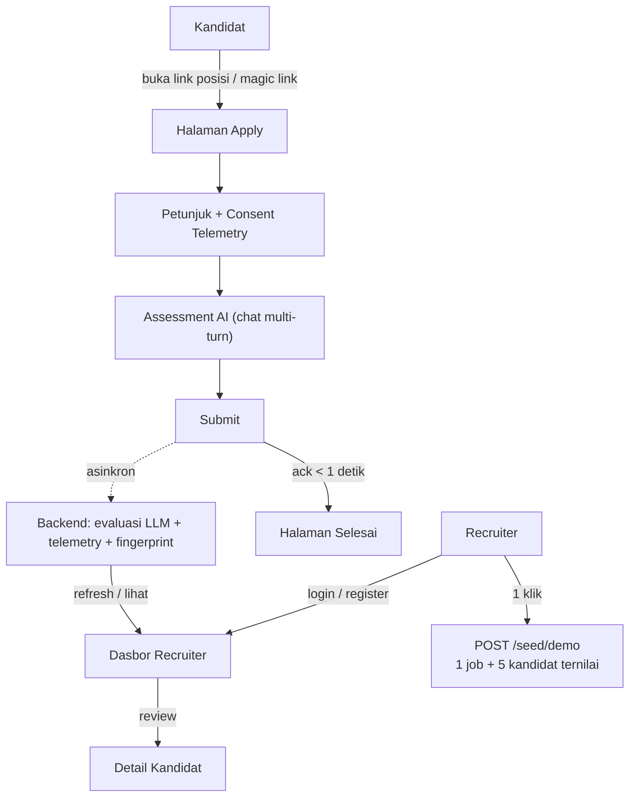
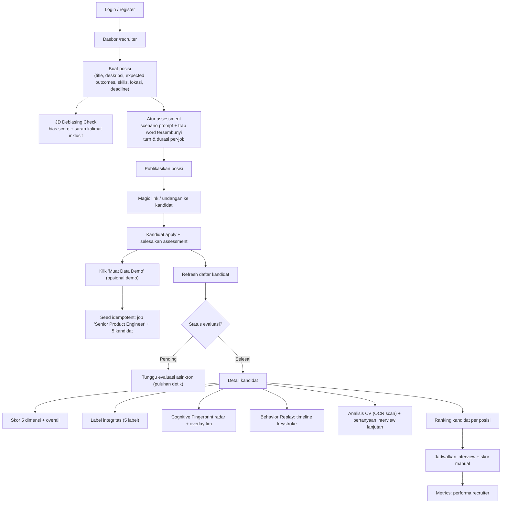
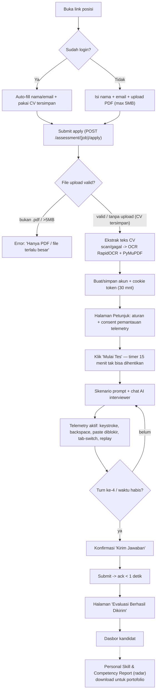
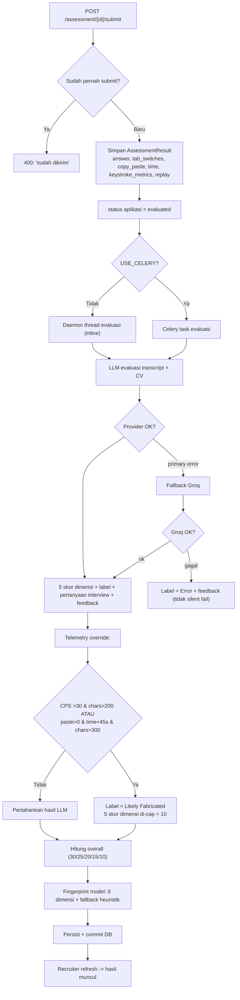
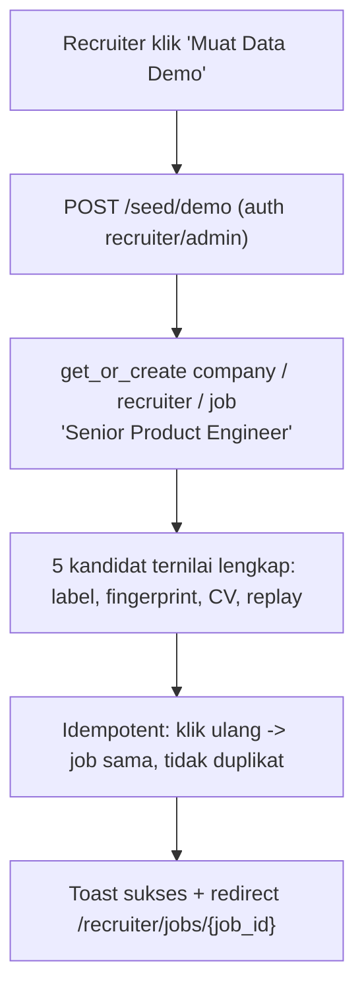

# Flowchart Alur Pengguna Skillens — Evidence-Based Hiring

> Lampiran teknis `INOVASI_SKILLENS.md` (v1.8).

---

## Diagram 1 — Aktor & Titik Masuk (High-level)

---

## Diagram 2 — Alur Recruiter (Detail)

---

## Diagram 3 — Alur Kandidat (Top-Funnel, Detail)

---

## Diagram 4 — Pipeline Evaluasi Backend (Detail)

---

## Diagram 5 — Alur Demo Final (Muat Data Demo, 1 Klik)

---

## Catatan untuk demo live (17 Okt)

1. **Skenario yang paling meyakinkan bukan recruiter, tapi kandidat**: buka magic link → apply → tes 4 turn → submit → muncul di dashboard recruiter. Ini belum disiapkan sebagai skenario demo.
2. **Jangan demo fitur yang belum diimplementasi** — juri bisa minta "tunjukkan sekarang".
3. Data demo idempotent: tombol bisa diklik berkali-kali tanpa menggandakan data — aman untuk demo berulang.